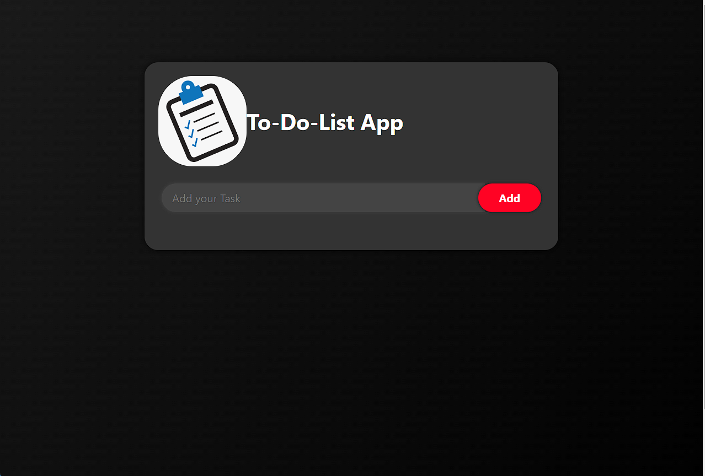

# TaskForge: A Comprehensive Task Management Tool

TaskForge is a feature-rich task management application built using JavaScript, HTML, and CSS. This project provides a user-friendly interface and powerful features to streamline task management, catering to both beginners and experienced developers.

## Key Features

- **Add New Tasks:** Quickly add tasks to your to-do list.
- **Mark Tasks as Completed:** Keep track of completed tasks.
- **Edit Task Details:** Easily modify task information.
- **Delete Tasks:** Remove tasks that are no longer needed.

## Screenshots

Include screenshots or GIFs to showcase the application's user interface and features.


## Usage

1. **Clone the Repository:**

```bash
git clone https://github.com/SriCharanD/To-Do-List-Git.git
```

Explore the capabilities of TaskForge and enhance your understanding of web development while efficiently managing your daily tasks and projects. TaskForge - your go-to solution for effective task management.